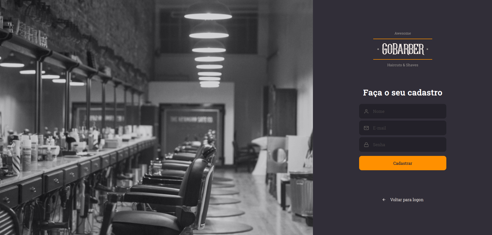

# Go Barber

<p align="left">
   
</p>

---

# :pushpin: Table of Contents

* [Features](#rocket-features)
* [Installation](#construction_worker-installation)
* [Getting Started](#runner-getting-started)
* [FAQ](#postbox-faq)
* [License](#closed_book-license)

<br />
<p align="center"></p>

# :rocket: Features

* #### Create an account as a service provider or as a costumer.
* #### Schedule and manage appointments
* #### Copying the dashboard URL to persist the selected month across multible browser tabs
* #### Handling loading when loading the provider month availability
* #### Listing notifications and marking them as read
* #### Updating user profile

# :construction_worker: Installation

**You need to install [Node.js](https://nodejs.org/en/download/) and [Yarn](https://yarnpkg.com/) first, then in order to clone the project via HTTPS, run this command:**

```git clone https://github.com/jonatasoc/gostack_gobarber_web.git```

SSH URLs provide access to a Git repository via SSH, a secure protocol. If you have a SSH key registered in your Github account, clone the project using this command:

```git@github.com:jonatasoc/gostack_gobarber_web.git```


# :postbox: Faq

**Question:** What are the tecnologies used in this project?

**Answer:** The tecnologies used in this project are [React](https://pt-br.reactjs.org/) + [Styled Components](https://styled-components.com/) to handle scoped CSS.

# :closed_book: License

Released in 2020 (Work in progress)
This project is under the [MIT license](https://github.com/LauraBeatris/gobarber-web/master/LICENSE).
